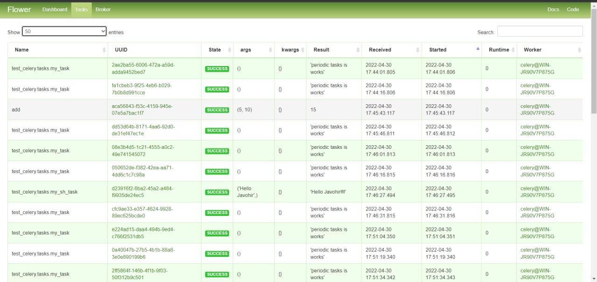
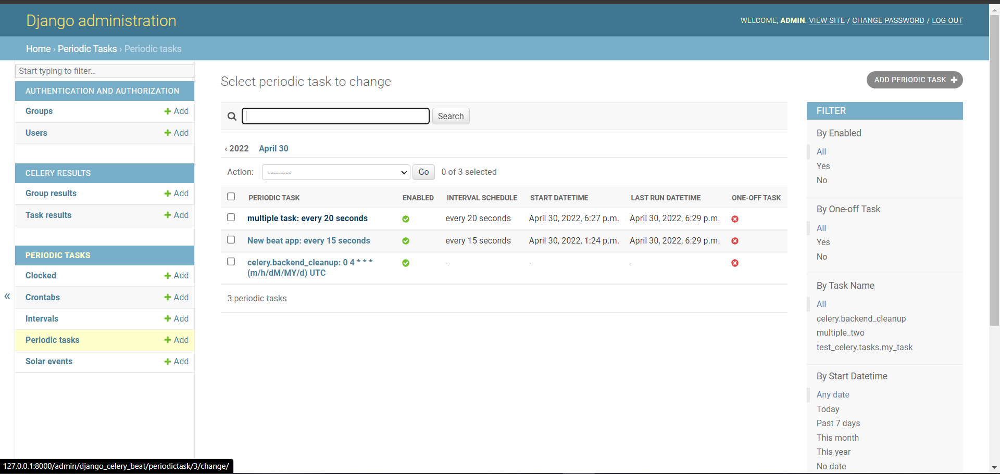

celery -A Django_redis worker -l info --concurrency 8 -P eventlet #   <! -- Celery 4 dan kattasini windowsga moslashtirish -->
 celery -A your-application worker -l info --pool=solo ## Celery ni Windows bilan integratsiya qilishda worker ni ishga tushuradi
 celery -A your-application beat -l info #  Periodic tasklarni ishga tushuradi periodic task larni ishga tushuradi
 celery -A your-application flower --loglevel=info # flowerni ishga tushurish 
 celery -A proj beat -l INFO --scheduler django_celery_beat.schedulers:DatabaseScheduler # beat mavjud schedule orqali ishga tushirish

  Periodic tasklarni qoshish

